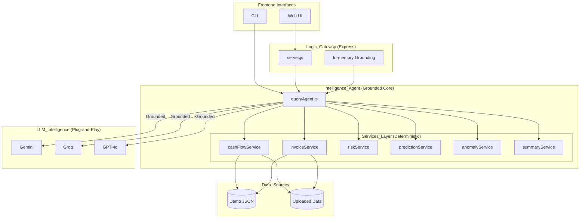
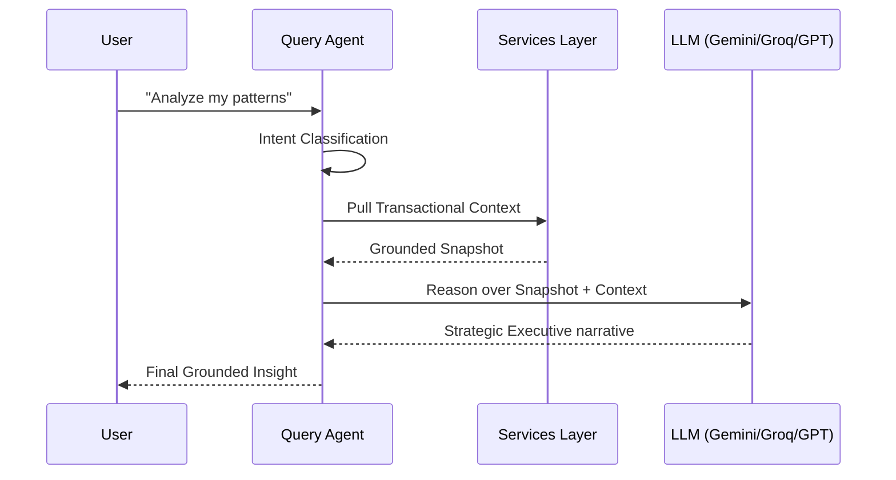

# CashGuardian

Talk to your business finances in plain English — via natural language, grounded in your operational reality.

🌐 **Live Demo**: [cash-guardian-three.vercel.app](https://cash-guardian-three.vercel.app/)


---

## Screenshots

### Web Dashboard

*Web UI showing overdue invoices, net balance, risk client, and 13-week cash flow chart*

### CLI — Help & Commands

*Terminal view of available natural-language commands*

### CLI — Monthly Comparison

*Month-over-month comparison output with income and expense deltas*

---

CashGuardian is a full-stack **Talk to Data** platform built for the hackathon. It converts natural-language finance questions into deterministic, data-grounded answers using a state-aware **Agentic Reasoning Engine**. It runs as both a reactive CLI and a professional, glassmorphism web interface.

The platform is designed for founders, operators, and analysts who need fast, trustworthy insights and **Executive PDF Reporting** without complex BI overhead.

---

## Problem Statement

Many teams struggle to extract quick, accurate, and trustworthy answers from operational data. They face tool complexity, ambiguous terminology, time pressure, and low confidence in outputs. CashGuardian reduces this friction by focusing on:

| Pillar | How CashGuardian addresses it | Key feature |
|---|---|---|
| **Clarity** | Plain-English answers via AI narrative — no BI jargon, no dashboards | `summaryService`, `queryAgent` |
| **Trust** | All AI responses grounded in locked local data; 13-case benchmark with ground-truth numbers verifies accuracy | `BENCHMARK.md`, context injection |
| **Speed** | Deterministic services return in <5ms; AI narrative is optional — works fully offline | avg 5.08ms, P95 56ms |

---

## Use Case Coverage

| # | Hackathon use case | CashGuardian feature | Example query | Status |
|---|---|---|---|---|
| 1 | Understand what changed | Anomaly detection — flags income/expense spikes vs 8-week rolling average | *"Are there unusual patterns in my spending?"* | ✅ Implemented |
| 2 | Compare (time periods) | Period comparison engine — WoW and MoM with % deltas and narrative | *"Compare this month vs last month"* | ✅ Implemented |
| 3 | Breakdown / decomposition | Expense breakdown by category with proportions; overdue invoices by client | *"Show me the expense breakdown"* | ✅ Implemented |
| 4 | Summarise (weekly/monthly) | AI-generated narrative covering revenue, expenses, overdue status, top risk | *"Give me a weekly summary"* | ✅ Implemented |

---

## Architecture

CashGuardian uses a **Grounded Reasoning** architecture. Every query is orchestrated by a state-aware agent that grounds operational data before it reaches the AI — ensuring responses are factually accurate, benchmarked, and never hallucinated.



### Intelligence flow



---

- **Agentic Reasoning**: State-aware orchestration for complex financial pivots (Variance, Comparison, Risk).
- **Excel-Proof Ingestion**: Robust handling of "dirty" localized CSV/Excel data (₹ symbols, commas, Indian dates).
- **Executive PDF Dossiers**: Professional report generation with a 13-week trend appendix.
- **Comparison Duels**: High-performance head-to-head entity and period analysis.
- **Grounding Logs**: Detailed source transparency for every AI narrative.
- **Voice Intelligence**: Built-in speech recognition for hands-free querying.
- **AI abstraction**: AI provider abstraction (`gemini`, `groq`, `openrouter`) with safe fallback handling
- **Web Dashboard**: Glassmorphism UI with real-time 13-week cash flow trajectory.
- **Benchmark Suite**: 13-case automated accuracy and latency runner.

---

## Install and Run

```bash
npm install
cp .env.example .env        # Linux / Mac
copy .env.example .env      # Windows
```

### Web UI (recommended)

```bash
npm run web
# Open http://localhost:3001
```

### CLI

```bash
npm start
```

### Demo (non-interactive showcase)

```bash
npm run demo
```

---

## Configuration

All required variables are in `.env.example`.

Minimum for AI responses:

```env
AI_PROVIDER=gemini          # gemini | groq | openrouter
AI_API_KEY=your-key-here
AI_MODEL=gemini-1.5-flash
PORT=3001
```

> Free Gemini key — no credit card needed: https://aistudio.google.com/app/apikey

> Free Groq key: https://console.groq.com — use `llama-3.1-8b-instant`

Optional for email reminders:

```env
EMAIL_HOST=smtp.gmail.com
EMAIL_PORT=587
EMAIL_USER=your-email@gmail.com
EMAIL_PASS=your-app-password
EMAIL_FROM=CashGuardian <your-email@gmail.com>
EMAIL_TO=demo-recipient@gmail.com
```

### Gmail App Password setup

1. Enable 2-Step Verification on the Gmail account
2. Create an App Password under Google Account → Security
3. Set `EMAIL_PASS` to the app password, not your account password

---

## Usage Examples

These are example phrasings — any natural language variation works. Type freely; the assistant understands intent, not exact commands.

```text
> What is my current cash balance?
Current net cash balance is −₹12,500.
Income: ₹9,25,500 | Expenses: ₹9,38,000

> Show me all overdue invoices
4 invoices are overdue, totalling ₹2,15,500.
Highest exposure: Sharma Retail — ₹96,000

> What will my cash look like in 30 days?
🔴 CASH RUNOUT RISK — collect ₹2,15,500 in overdue invoices before expenses fall due.
Week 2026-W16 projected balance: ₹47,625
Week 2026-W17 projected balance: ₹46,750
Week 2026-W18 projected balance: ₹1,22,875
Week 2026-W19 projected balance: ₹1,65,000
```

---

## Tech Stack

| Layer | Tools |
|---|---|
| Runtime | Node.js 18+ |
| CLI | readline |
| Backend | Express |
| Frontend | Vanilla HTML / CSS / JS |
| Charts | Chart.js |
| AI | Gemini / Groq / OpenRouter |
| Dates | date-fns |
| Email | Nodemailer |
| Config | dotenv |
| Testing | Jest |

---

## Data Sources

Core financial logic runs only on locked local files:

- `data/transactions.json` — 90-day cash flow ledger
- `data/invoices.json` — invoice and payment history
- `data/metrics.json` — 13 weekly KPI snapshots

AI narrative quality is additionally guided by:

- `data/externalValidation.json` — IBM, UCI, World Bank validation references

Benchmark numbers come from the locked local dataset. External references provide narrative grounding context only. Uploaded files are processed in-memory and never saved to disk.

---

## Benchmark

Verified against 13 ground-truth finance cases. Max score: 55.

- Cases executed: `13/13`
- Errors: `0`
- Average latency: `5.08ms`
- P50 latency: `1ms`
- P95 latency: `56ms`

| Benchmark | Category | Latency (ms) |
|---|---|---:|
| BM-01 | Cash Balance | 56 |
| BM-02 | Cash Summary | 0 |
| BM-03 | Expense Breakdown | 0 |
| BM-04 | Overdue Invoices | 4 |
| BM-05 | Client History | 0 |
| BM-06 | Risk Report | 0 |
| BM-07 | Single Client Risk | 1 |
| BM-08 | 30-Day Forecast | 1 |
| BM-09 | Cash Runout Risk | 0 |
| BM-10 | Anomaly Detection | 1 |
| BM-11 | Logistics Spike | 0 |
| BM-12 | Month Comparison | 0 |
| BM-13 | Weekly Summary | 1 |

Full benchmark definitions and scoring rubric: [BENCHMARK.md](./BENCHMARK.md)

---

## Privacy and Trust

- **Local first** — all data processing happens on your machine
- **Privacy mode** — uploaded files are stored in-memory for the session only, never written to disk
- **Grounding logs** — every AI response includes a "How was this answered?" transparency section showing intent, services called, and data source
- **No hallucination** — AI receives a pre-computed financial snapshot, not raw data; it explains, it does not calculate

---

## Test Status

- Jest suites: `8/8` passing
- Total automated tests: `67` passing

---

## Submission Checklist

1. `npm install`
2. `npm test` — expect `8/8` suites, `67` tests passing
3. `npm run benchmark:verbose` — updates `benchmark-results.json`
4. `npm run demo` — showcase command flow including reminder
5. `npm run web` — confirm web UI loads at `http://localhost:3001`
6. Confirm `.env` is not committed and `.env.example` is complete
7. Confirm all commits are signed off (`git commit -s`)
8. Share repository URL

---

## Documentation

- [Architecture](./docs/architecture.md)
- [Methodology](./docs/methodology.md)
- [CLI usage](./docs/cli-usage.md)
- [Data model](./docs/data-model.md)

---

## Limitations

- AI output quality depends on the configured provider and API availability
- Email reminder flow requires valid SMTP app credentials for live verification
- Uploaded dataset queries use heuristic column detection — works best with clearly named columns

---

## Future Improvements

- Automated benchmark scoring against deterministic outputs
- Structured JSON output mode for dashboard integration
- Richer entity extraction for multi-client queries
- Persistent session history across page reloads

---

##  Deployment (Vercel)

CashGuardian is pre-configured for one-click deployment to **Vercel**.

1. **Push to GitHub**: Ensure all changes are pushed to your repository.
2. **Import to Vercel**: Connect your GitHub repo to Vercel.
3. **Environment Variables**: In the Vercel Dashboard, add your `.env` variables:
   - `AI_PROVIDER` (e.g., `gemini`)
   - `AI_API_KEY` (Your key)
   - `AI_MODEL` (e.g., `gemini-1.5-flash`)
4. **Deploy**: Vercel will automatically detect `vercel.json` and serve the platform.

---

## License

Apache 2.0. See [LICENSE](./LICENSE).
