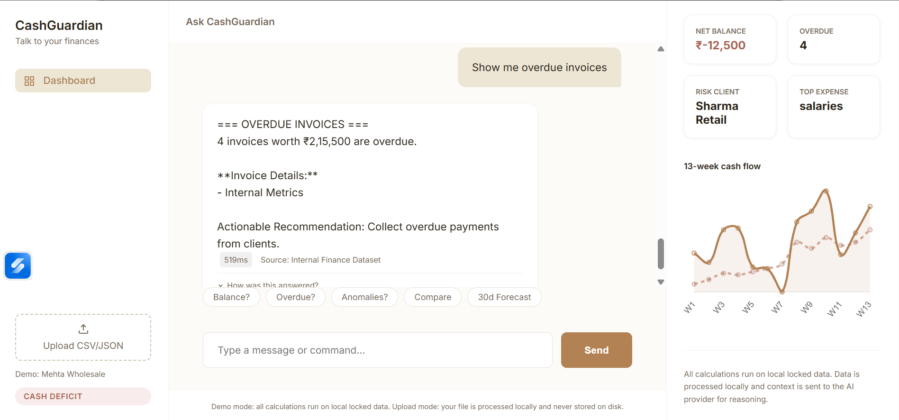
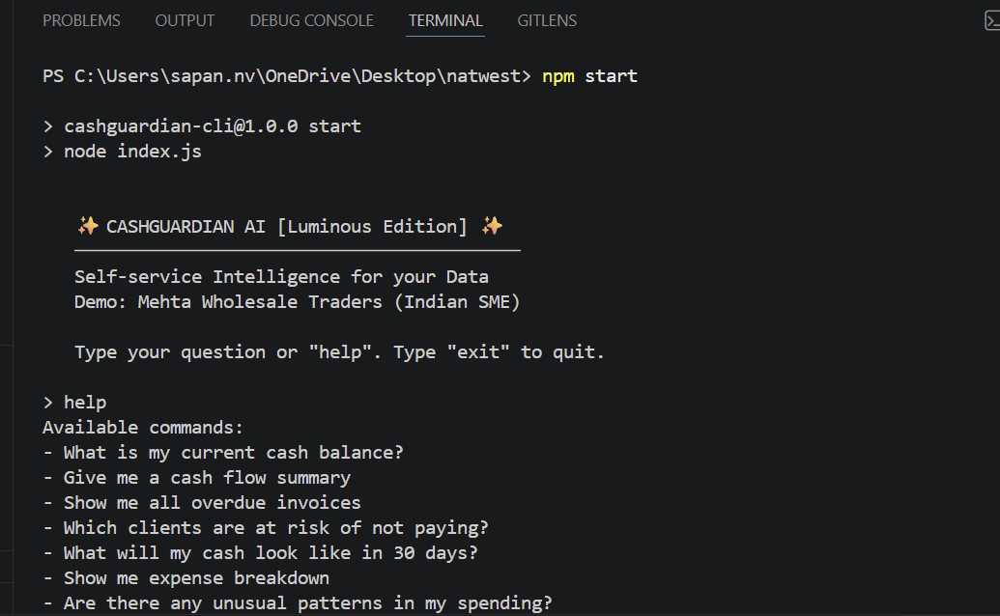
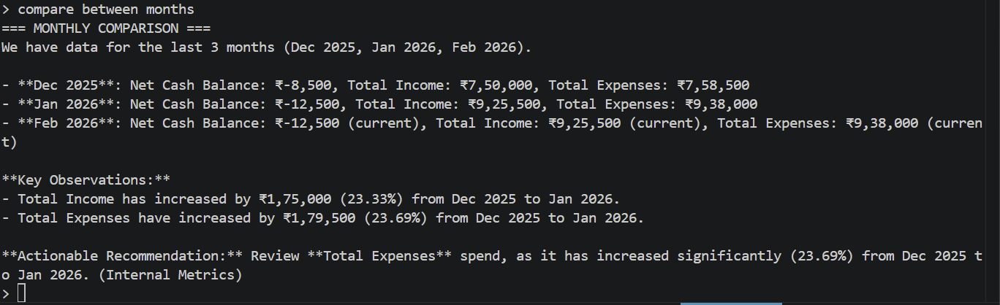
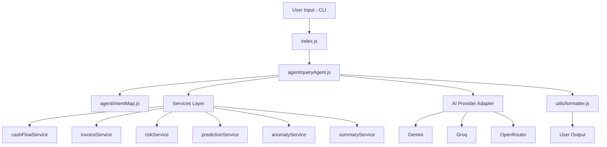

# CashGuardian 

Talk to your business finances in plain English.

🌐 **Live Demo**: [cash-guardian-three.vercel.app](https://cash-guardian-three.vercel.app/)


## Screenshots

### Web Dashboard

*Web UI showing overdue invoices, net balance, risk client, and 13-week cash flow chart*

### CLI — Help & Commands

*Terminal view of available natural-language commands*

### CLI — Monthly Comparison

*Month-over-month comparison output with income and expense deltas*

---

## Overview

CashGuardian is a Node.js CLI assistant for SME finance analysis in the "Talk to Data" hackathon track. It converts natural-language finance questions into deterministic, data-grounded answers and optionally uses free-tier AI providers for narrative responses. The intended users are founders, operators, and analysts who need fast and trustworthy insights without complex BI workflows.

## Problem Statement

Many teams struggle to extract quick, accurate, and trustworthy answers from operational data. They face tool complexity, ambiguous terminology, time pressure, and low confidence in outputs. CashGuardian reduces this friction by focusing on:

- Clarity: plain-language answers for non-experts
- Trust: consistent metric definitions and transparent data grounding
- Speed: near-instant responses through a lightweight CLI flow

## Problem Statement Alignment

| Pillar | How CashGuardian addresses it | Key feature |
|---|---|---|
| **Clarity** | Plain-English answers via AI narrative — no BI jargon, no dashboards | `summaryService`, `queryAgent` |
| **Trust** | All AI responses grounded in locked local data; 13-case benchmark with ground-truth numbers verifies accuracy | `BENCHMARK.md`, context injection |
| **Speed** | Deterministic services return in <5ms; AI narrative is optional — CLI works fully offline | avg 5.08ms, P95 56ms |

## Use Case Coverage

| # | Hackathon use case | CashGuardian feature | Example query | Status |
|---|---|---|---|---|
| 1 | Understand what changed | Anomaly detection — flags income/expense spikes vs 8-week rolling average | *"Are there unusual patterns in my spending?"* | ✅ Implemented |
| 2 | Compare (time periods) | Period comparison engine — WoW and MoM with % deltas and narrative | *"Compare this month vs last month"* | ✅ Implemented |
| 3 | Breakdown / decomposition | Expense breakdown by category with proportions; overdue invoices by client | *"Show me the expense breakdown"* | ✅ Implemented |
| 4 | Summarise (weekly/monthly) | AI-generated narrative covering revenue, expenses, overdue status, top risk | *"Give me a weekly summary"* | ✅ Implemented |

## Working Features

- Deterministic cash, invoice, risk, anomaly, and forecast services
- Intent-based query routing (`cash`, `overdue`, `risk`, `compare`, `summary`, `prediction`)
- AI provider abstraction (`gemini`, `groq`, `openrouter`) with safe fallback handling
- Prompt context injection using:
  - locked operational dataset (`transactions`, `invoices`, `metrics`)
  - external validation references (`externalValidation.json`)
- Benchmark runner with per-case latency capture
- Jest test suite for services + query routing

## Architecture

```text
User Input → index.js → queryAgent → intentMap → Services → AI Provider → formatter → Output
```



## Install and Run

```bash
npm install
cp .env.example .env        # Linux / Mac
copy .env.example .env      # Windows
npm test
npm start
```

Quick showcase run (non-interactive):

```bash
npm run demo
```

## Configuration

Required variables are listed in `.env.example`.

Minimum for AI responses:

- `AI_PROVIDER`
- `AI_API_KEY`
- `AI_MODEL`

> Free Gemini key (no credit card): https://aistudio.google.com/app/apikey — set `AI_PROVIDER=gemini`

Optional for reminder email testing:

- `EMAIL_HOST`
- `EMAIL_PORT`
- `EMAIL_USER`
- `EMAIL_PASS`
- `EMAIL_FROM`
- `EMAIL_TO` (optional fallback recipient; useful for demos)

### Gmail reminder setup

For live reminder emails, use a dedicated Gmail account and App Password:

1. Enable 2-Step Verification on the Gmail account.
2. Create an App Password.
3. Set `EMAIL_USER` to the Gmail address.
4. Set `EMAIL_PASS` to the app password.
5. For demo safety, set `EMAIL_TO` to your own inbox.

## Tech Stack

- Runtime: Node.js
- CLI: readline
- AI: Gemini / Groq / OpenRouter
- Date utilities: date-fns
- Email: Nodemailer
- Config: dotenv
- Testing: Jest

## Usage Examples

- `What is my current cash balance?`
- `Give me a cash flow summary`
- `Show me all overdue invoices`
- `Which clients are at risk of not paying?`
- `What will my cash look like in 30 days?`
- `Compare this month vs last month`
- `Give me a weekly summary`
- `Send a payment reminder to Sharma Retail`

## Data Sources

Runtime business calculations are performed only on locked local data files:

- `data/transactions.json`
- `data/invoices.json`
- `data/metrics.json`

AI narrative quality is additionally guided by:

- `data/externalValidation.json`

This means benchmark numbers come from benchmark-locked local data; external references provide realism context only.

## Benchmark

Benchmark definitions live in:

- `BENCHMARK.md`
- `tests/benchmark.js`

Latest benchmark run snapshot (from local `benchmark-results.json`):

- Cases executed: `13/13`
- Errors: `0`
- Average latency: `5.08ms`
- P50 latency: `1ms`
- P95 latency: `56ms`
- Max latency: `56ms`

| Benchmark | Category | Latency (ms) |
|---|---|---:|
| BM-01 | Cash Balance | 56 |
| BM-02 | Cash Summary | 0 |
| BM-03 | Expense Breakdown | 0 |
| BM-04 | Overdue Invoices | 4 |
| BM-05 | Client History | 0 |
| BM-06 | Risk Report | 0 |
| BM-07 | Single Client Risk | 1 |
| BM-08 | 30-Day Forecast | 1 |
| BM-09 | Cash Runout Risk | 0 |
| BM-10 | Anomaly Detection | 1 |
| BM-11 | Logistics Spike | 0 |
| BM-12 | Month Comparison | 0 |
| BM-13 | Weekly Summary | 1 |

## Submission Checklist (Round 1)

Before submitting GitHub URL:

1. `npm install`
2. `npm test` (expect `8/8` suites, `67` tests passing)
3. `npm run benchmark:verbose` (updates `benchmark-results.json`)
4. `npm run demo` (showcase command flow, including reminder action)
5. Confirm `.env` is not committed and `.env.example` is complete
6. Confirm all commits are signed off (`git commit -s`)
7. Share repository URL

## Test Status

- Jest suites: `8/8` passing
- Total automated tests: `67` passing

## Documentation

- [Architecture](./docs/architecture.md)
- [Methodology](./docs/methodology.md)
- [CLI usage](./docs/cli-usage.md)

## Limitations

- AI output quality depends on the configured provider and API availability
- Email reminder flow requires valid SMTP app credentials for live verification
- Uploaded dataset queries use heuristic column detection — works best with clearly named columns

---

## Future Improvements

- Add automated benchmark scoring (not just manual rubric fields)
- Add structured JSON output mode for dashboard integration
- Expand intent parsing with entity extraction for richer multi-client queries

##  Deployment (Vercel)

CashGuardian is pre-configured for one-click deployment to **Vercel**.

1.  **Push to GitHub**: Ensure all changes are pushed to your repository.
2.  **Import to Vercel**: Connect your GitHub repo to Vercel.
3.  **Environment Variables**: In the Vercel Dashboard, add your `.env` variables:
    - `AI_PROVIDER` (e.g., `gemini`)
    - `AI_API_KEY` (Your key)
    - `AI_MODEL` (e.g., `gemini-1.5-flash`)
4.  **Deploy**: Vercel will automatically detect `vercel.json` and serve the platform.

---

## 🏛️ License

Apache 2.0. See `LICENSE`.
