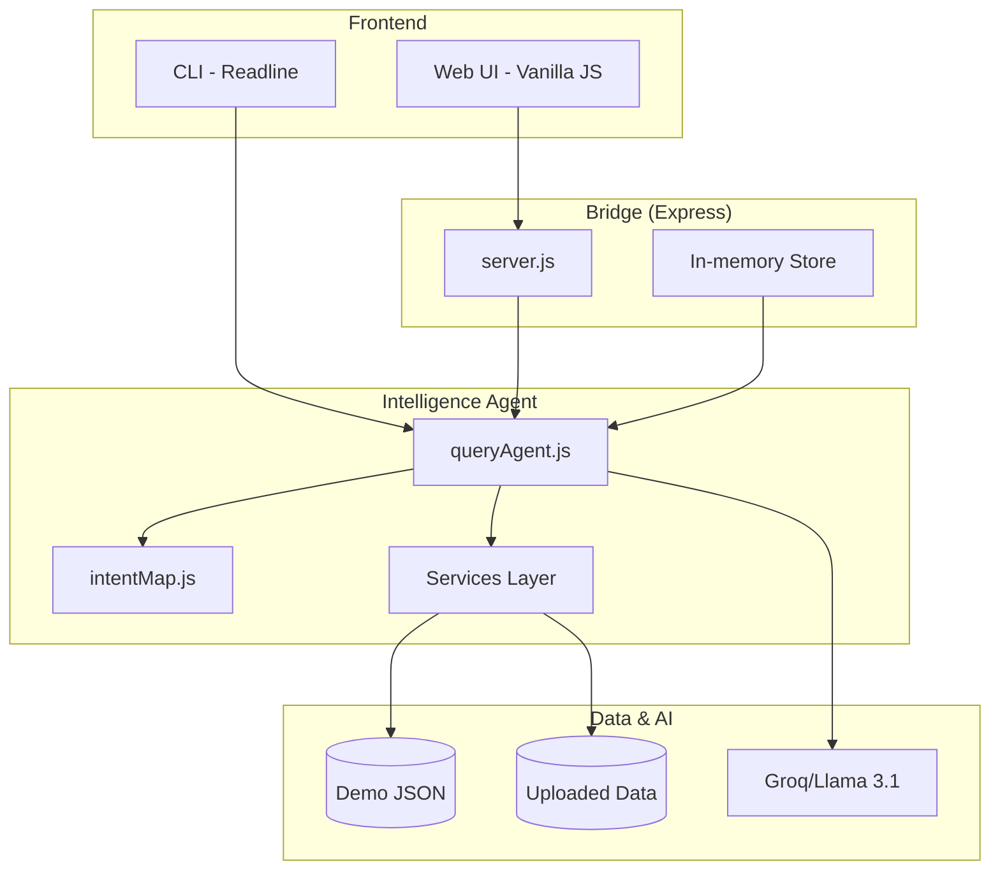
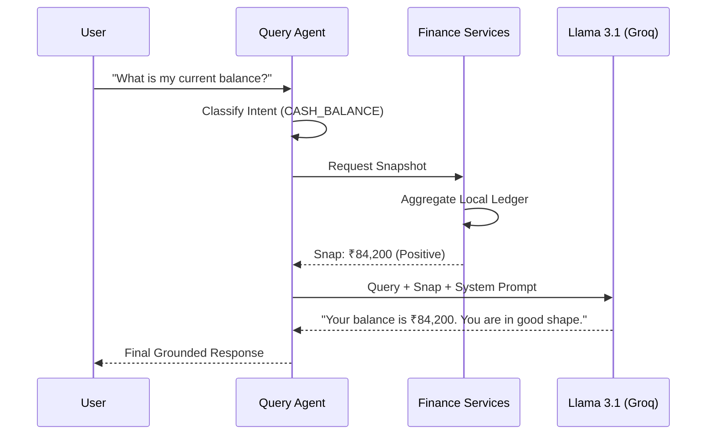

# Architecture: CashGuardian [Luminous Edition]

CashGuardian is built as a **Local-First AI Assistant**. It uses a layered architecture to ensure that financial logic remains deterministic while AI reasoning provides a natural-language bridge.

---

## 🏗️ System Overview

The system operates via two interfaces (CLI and Web) that funnel into a single **Query Agent**.

---

## 🔄 The Query Lifecycle

Every question asked to CashGuardian goes through a "Grounding First" pipeline:

---

## 📂 Component Breakdown

### 1. `server.js` (Web Bridge)
A minimalist Express server that serves the `web/` static files and provides API endpoints for:
- `/api/upload`: In-memory ingestion of CSV/JSON files.
- `/api/query`: Logic-agnostic interface for the Web UI.
- `/api/snapshot`: Real-time metric gathering for the "Dataset Overview" panel.

### 2. `agent/queryAgent.js` (Intelligence Core)
The primary orchestrator. It is responsible for:
- Mapping inputs to intents.
- Gathering required facts from services.
- Building the **Grounding Context** for the AI.

### 3. `agent/intentMap.js` (The Traffic Controller)
Uses high-performance keyword mapping to determine if a query is deterministic (e.g., "Balance") or narrative (e.g., "Analyze my patterns").

### 4. Services Layer (`services/`)
A suite of immutable logic modules that perform calculations on the data.
- **`cashFlowService.js`**: Ledger aggregation and trends.
- **`invoiceService.js`**: Status tracking and aging analysis.
- **`riskService.js`**: Customer reliability scoring.

---

## 🔒 Security & Data Privacy

- **No Persistence**: Uploaded datasets are kept in RAM (`activeDataset`) and are destroyed when the server restarts.
- **Selective Grounding**: Only relevant data extracts are sent to the AI provider. Raw, PII-heavy files are never transmitted in their entirety.
- **Local Fallback**: The system functions entirely on local data; if the AI provider is unavailable, it returns a concise data-only response.
