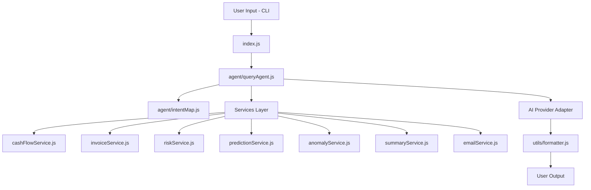
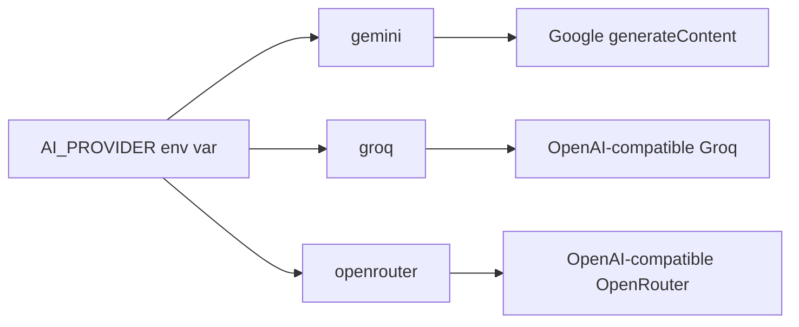

# Architecture

## Layered Design

## Query Lifecycle

1. The user enters a natural-language question in the CLI.
2. `index.js` reads the query and forwards it to `agent/queryAgent.js`.
3. `intentMap.js` classifies the query with deterministic keyword matching.
4. Relevant services compute the financial facts from locked local JSON.
5. The agent either:
   - returns a direct rule-based response, or
   - builds a system prompt and sends the grounded snapshot to the configured AI provider.
6. The system prompt includes external validation references from `data/externalValidation.json` to reinforce realism and reduce hallucinated assumptions.
7. `formatter.js` renders the result for the terminal.

## AI Provider Abstraction

This separation keeps business logic independent from vendor-specific request formatting. Switching providers requires only a `.env` change — no code changes.

## Secret Handling

- All secrets come from environment variables only
- `.env.example` contains placeholders, never real values
- `AI_API_KEY`, `EMAIL_USER`, and `EMAIL_PASS` are never committed intentionally
- Services and agents avoid logging secrets to stdout
- All commits are signed off per DCO requirements (`git commit -s`)

## Data Sources

- `data/transactions.json`: 90-day cash flow ledger
- `data/invoices.json`: invoice and payment history
- `data/metrics.json`: weekly KPI snapshots
- `data/externalValidation.json`: public-dataset validation notes used as AI context

The first three files are benchmark-locked and should not be regenerated or edited during feature work. The external validation file is descriptive context and should remain stable unless references are intentionally updated.
