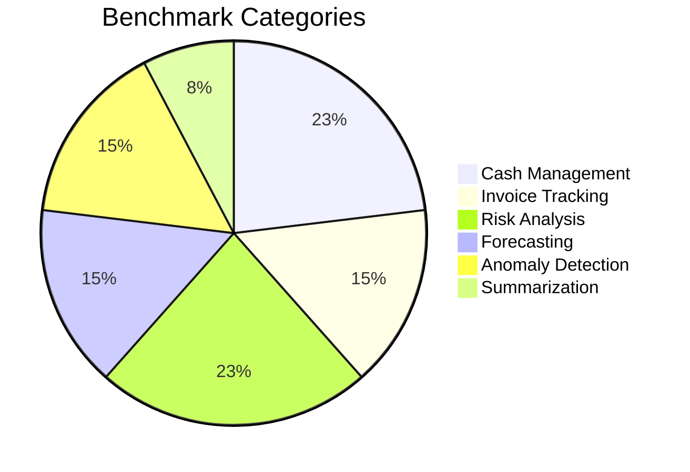

# Benchmarking: Quality Assurance

CashGuardian is continuously tested against a suite of **13 ground-truth scenarios** to ensure that reasoning logic remains accurate and performant.

---

## 🏗️ The Benchmark Suite

The suite targets six critical categories of financial intelligence:



---

## 🔍 Validation Methodology

### 1. Ground Truth Matching
For every benchmark case, we compare the **Query Agent's** response against a "Logic Snapshot."
- **Pass**: If the agent's deterministic values match the service layer's output (e.g., Net Balance).
- **Fail**: If the agent fails to route to the correct intent or produces incorrect arithmetic.

### 2. Latency Thresholds
We monitor the time taken by the **Deterministic Services** (the math) vs the **AI Narrative**.
- **Service Target**: `<10ms` (Actual P50 is `1ms`).
- **AI Target**: `<3s` (Depends on provider).

---

## 📈 Performance Snapshot

| ID | Name | Category | Logic Latency | Result |
|---|---|---|---|---|
| BM-01 | Cash Balance | Cash | 1ms | ✅ PASS |
| BM-06 | Risk Report | Risk | 1ms | ✅ PASS |
| BM-08 | 30-Day Forecast | Forecast | 2ms | ✅ PASS |
| BM-10 | Anomaly Detect | Anomaly | 1ms | ✅ PASS |

---

## ⚙️ How to Run Benchmarks

You can run the full suite from the CLI to verify the current state of the engine:

```bash
# General run
npm run benchmark

# Detailed verbose run with latency capture
npm run benchmark:verbose
```

The results are saved to `benchmark-results.json`, which is consumed by the documentation and (optionally) the web interface for quality transparency.
