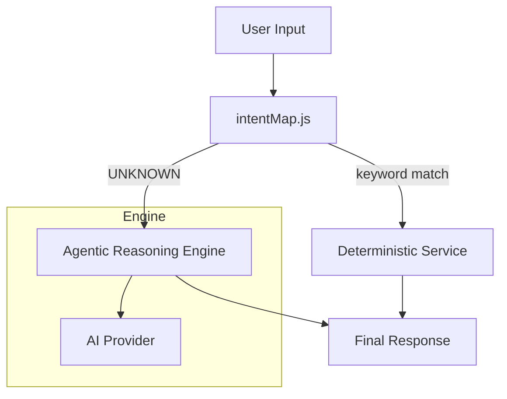
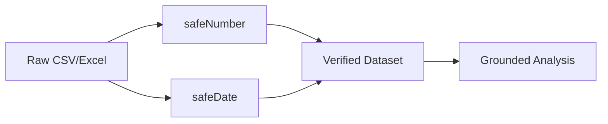
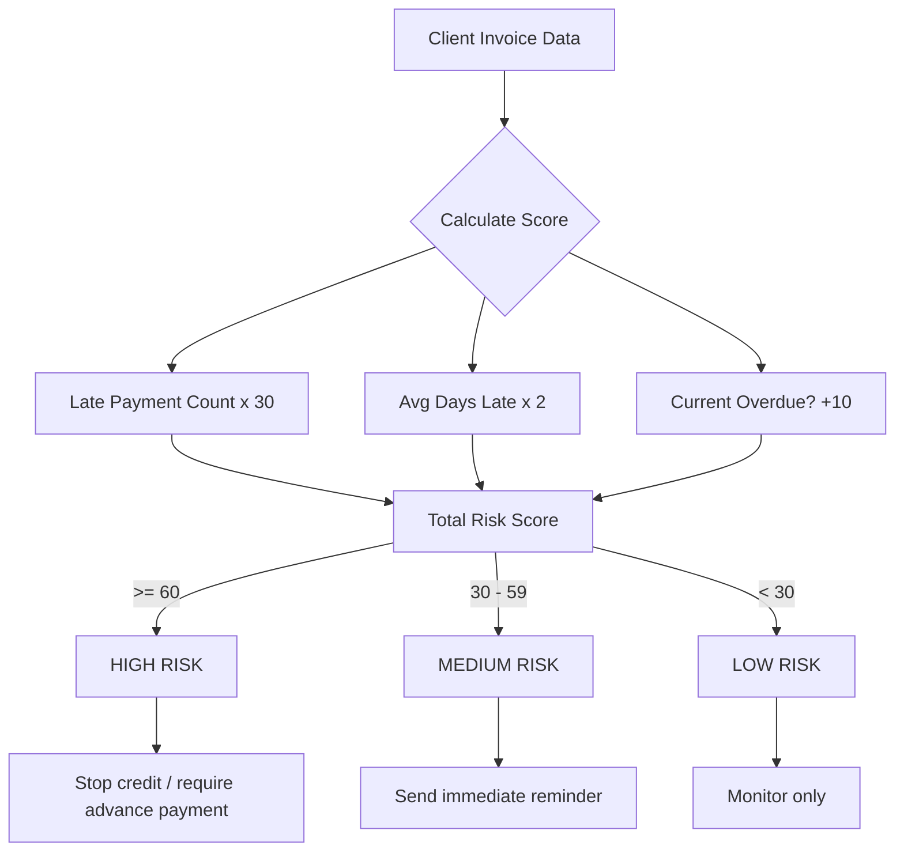
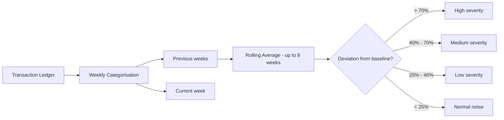
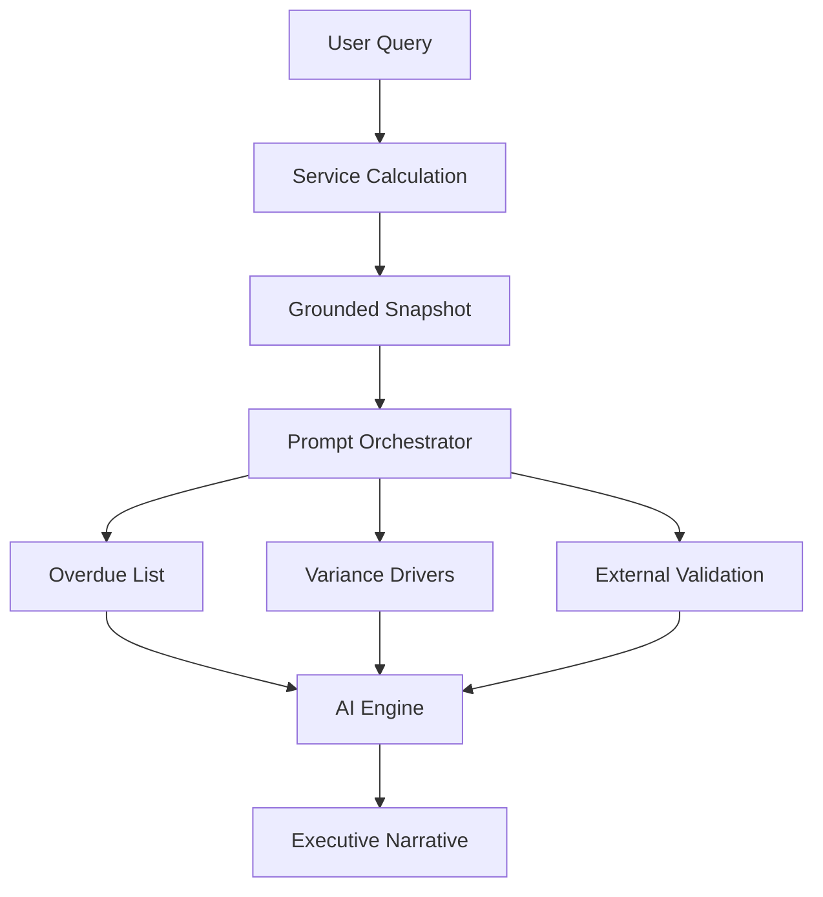

# Methodology

Every insight in CashGuardian is derived from deterministic formulas before being narrated by AI. The AI explains — it does not calculate.

---

## Intent Classification

CashGuardian starts with deterministic keyword matching in `intentMap.js`. This keeps common finance questions predictable and fast. AI is used as a fallback for `UNKNOWN` or narrative-heavy queries, not as the source of truth for metrics.

Intent matching is:
- case-insensitive
- checked in documented rule order
- designed to map user phrasing into service calls before any AI formatting step



---

## Excel-Proof Data Ingestion

CashGuardian features a robust sanitization layer designed to handle the "dirty" data typically found in manual Excel exports or localized SME ledgers.

### Sanitization Workflow:
1. **Currency Normalization**: Strips ₹, $, commas, and whitespace before casting to absolute numbers.
2. **Robust Date Parsing**: Automatically detects and converts `DD-MM-YYYY`, `DD/MM/YYYY`, and partial ISO formats into standardized UTC dates.
3. **Implicit Classification**: If a transaction `type` is missing, the engine infers `income` vs `expense` based on numeric sign (positive/negative).



---

## Risk Scoring

Risk scoring determines client reliability based on payment history.



The formula is fixed:

```text
riskScore = (latePaymentCount × 30) + (avgDaysLate × 2) + (hasCurrentOverdue ? 10 : 0)
```

Where:
- `latePaymentCount` — invoices where `paymentHistory[0] > dueDate`
- `avgDaysLate` — average days late across those invoices
- `hasCurrentOverdue` — adds 10 points if client has a currently overdue invoice

Risk bands:
- `HIGH` — score >= 60
- `MEDIUM` — score 30–59.99
- `LOW` — score < 30

---

## Anomaly Detection

Anomalies are detected using a rolling baseline to filter out normal operational noise.



Algorithm:
1. Build weekly totals from the transaction ledger, grouped by `type + category`
2. For each week, calculate a rolling average from up to the previous 8 non-zero weeks
3. Flag an anomaly when the current week deviates more than 25% above baseline
4. Assign severity:

```text
low:    25% – 40%
medium: 40% – 70%
high:   > 70%
```

Rationale:
- 25% is large enough to ignore normal operating noise
- 40% indicates a materially unusual change that deserves attention
- 70% captures genuinely sharp operational spikes

---

## 30-Day Prediction

The predictor is intentionally simple and transparent — explainable and easy to benchmark.

Algorithm:
1. Calculate average weekly income and expenses from the last 8 transaction weeks
2. Identify upcoming invoices with `status = "unpaid"`
3. Spread forward into 4 weekly projection buckets
4. Add invoice due amounts into the matching future week as projected inflow
5. Flag `cashRunoutRisk` if the balance starts below or dips below ₹10,000

This is not a full forecasting model — it is a transparent projection that any user can verify manually.

---

## Context Injection

1. **Identity Block**: Defines the persona as **CashGuardian AI**, professional and data-anchored.
2. **Live Data Block (Primary)**: Injects the **Grounded Snapshot** (Net balance, Income/Expenses, Top Category).
3. **Overdue Invoices Block**: Injects a detailed `overdueList` with specific client names, amounts, and dates to prevent identification hallucinations.
4. **Variance Drivers Block**: Injects categorical MoM changes (e.g., "Marketing +107%") allowing the AI to answer "Why?" questions accurately.
5. **External Validation Block**: Injects industry baselines from World Bank/IBM/UCI.



---

## Dataset Validation

The synthetic dataset was informed by public sources:
- IBM Finance Factoring late-payment histories
- UCI Online Retail II
- World Bank MSME Country Indicators

These references were used to validate:
- realistic invoice delay patterns
- plausible wholesale sales levels
- SME cost structures where salaries and logistics dominate expenses

The project treats the locked local JSON files as the final source of truth when benchmark docs and raw data disagree.