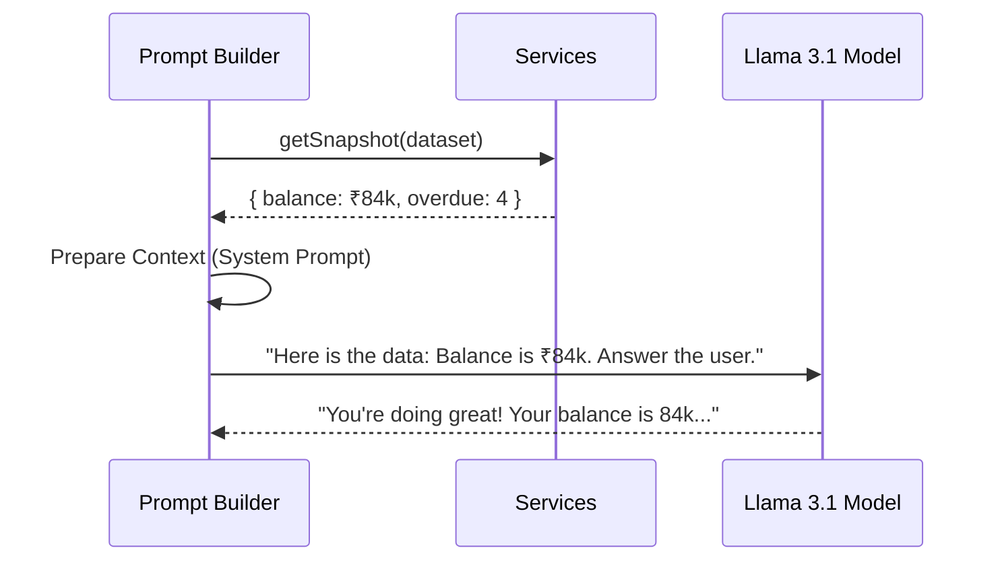

# Prompt Strategy: Grounding First

CashGuardian uses a **Retrieval-Augmented Reasoning (RAR)** strategy to ensure that Llama-3 (or any other LLM) remains a truthful narrator of financial data.

---

## 🏗️ The Grounding Loop

AI is notoriously bad at math. To solve this, CashGuardian **never** asks the AI to calculate totals. Instead, we compute the math in Node.js and provide the **result** to the AI.

---

## 📝 The System Prompt Structure

The system prompt is dynamically assembled for every query. It consists of four distinct "Grounding Blocks":

### 1. Identity Block
Defines the persona as **CashGuardian AI**, a professional finance assistant for Indian SMEs.

### 2. Live Data Block (Primary Grounding)
The most critical block. It contains the exact numbers pulled from the `Services` layer (Net balance, overdue count, etc.). If a custom dataset is uploaded, a **sampling of rows** is also injected to give the AI a "feel" for the data structure.

### 3. External Validation Block
Injects reference data from `data/externalValidation.json`. This provides industrybaselines (e.g., typical logistics costs) to help the AI identify if a company's spending is "normal" or "anomalous" compared to peers.

### 4. Constraint Block
Hard constraints on what the AI can and cannot say:
- **Rule 1**: Never invent a number. Use only the provided snapshot.
- **Rule 2**: Admit when data is missing.
- **Rule 3**: Stay professional and data-grounded.

---

## 🚀 Performance Optimization
By providing a pre-calculated snapshot, we reduce the amount of "reasoning steps" the AI needs to take. This results in:
- **Lower Latency**: The AI can jump straight to the narrative.
- **Higher Accuracy**: Eliminate mathematical rounding errors common in LLMs.
- **Smaller Context Window**: We only send the summary, not the entire JSON ledger (unless sampling is required).
