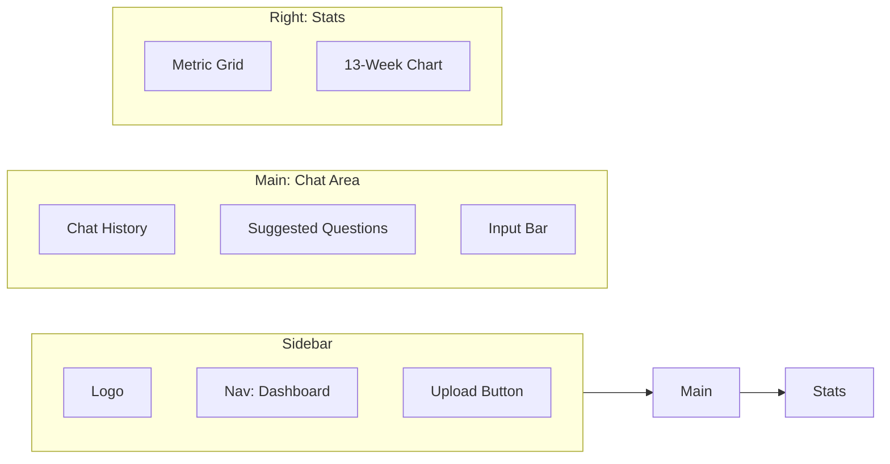

# Web UI: The "Warm Notebook" Guide

The CashGuardian Web UI is a premium, single-file interface designed to make financial intelligence approachable and calm.

---

## 🎨 Design Philosophy
Inspired by **Physical Finance Journals**, the UI uses:
- **Off-white Backgrounds**: Reduces eye strain during long analysis sessions.
- **Amber Accents**: Highlights critical growth and revenue metrics.
- **Three-Panel Layout**: Everything you need is visible at a glance.

---

## 🏗️ Layout Overview

---

## 📂 Handling Datasets

### 1. Uploading Data
You can upload any **CSV** or **JSON** file containing financial transactions or invoices. 
1. Click **"Upload CSV/JSON"** in the sidebar.
2. Once processed, the **Dataset Overview** panel will automatically update with the new numbers.
3. The AI is now grounded in **your data**.

### 2. Intelligent Inference
When a custom dataset is uploaded, CashGuardian scans the first few rows to understand the "Schema" (column names). It then uses this context to answer questions about specific columns (e.g., "What was the total for the 'Gross Amount' column?").

---

## 🛡️ Transparency & Trust

Every AI response includes a **"How was this answered?"** section.
- **Intent**: Shows what the system thought you were asking for (e.g., Anomaly Detection).
- **Data Grounding**: Confirms that your local data was used as the source of truth.
- **Latency**: Shows exactly how long the logic took vs the AI narrative.

---

## ⌨️ Shortcuts
- **Enter**: Send your query.
- **Suggested Pills**: Click on "Balance?", "Overdue?", or "Compare" to run instant reports without typing.
