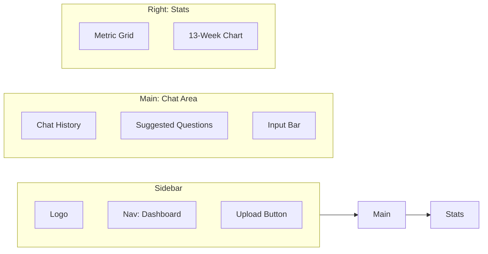

# Web UI: The "Warm Notebook" Guide

The CashGuardian Web UI is a premium, single-file interface designed to make financial intelligence approachable and calm.

---

## 🎨 Design Philosophy
Inspired by **Physical Finance Journals**, the UI uses:
- **Off-white Backgrounds**: Reduces eye strain during long analysis sessions.
- **Amber Accents**: Highlights critical growth and revenue metrics.
- **Three-Panel Layout**: Everything you need is visible at a glance.

---

## 🏗️ Layout Overview

---

## 📂 Handling Datasets

### 1. Uploading Data
You can upload any **CSV** or **JSON** file containing financial transactions or invoices. 
1. Click **"Upload CSV/JSON"** in the sidebar.
2. The **Excel-Robust Ingestion Engine** automatically cleanses data (stripping ₹ symbols/commas and standardizing date formats).
3. Once processed, the **Dataset Overview** panel will automatically update.

### 2. Comparison Duels
For head-to-head analysis, use the "Duel" feature by asking: *"Compare Logistics versus Marketing"* or *"Compare Sharma Retail vs Patel Distributors"*.
- The UI renders a side-by-side performance breakdown.
- Context is automatically injected to highlight the growth/volume delta between the two entities.

### 3. Executive PDF Dossiers
Need a portable report for stakeholders?
1. Click the **"Export PDF"** button (top right of the sidebar).
2. The system generates a high-fidelity PDF containing your current balance, the 13-week trend chart, and a grounded AI narrative of your financial health.

---

## 🛡️ Transparency & Trust

Every AI response includes a **"How was this answered?"** section.
- **Intent**: Shows what the system thought you were asking for (e.g., Anomaly Detection).
- **Data Grounding**: Confirms that your local data was used as the source of truth.
- **Latency**: Shows exactly how long the logic took vs the AI narrative.

---

## ⌨️ Shortcuts
- **Enter**: Send your query.
- **Suggested Pills**: Click on "Balance?", "Overdue?", or "Compare" to run instant reports without typing.
