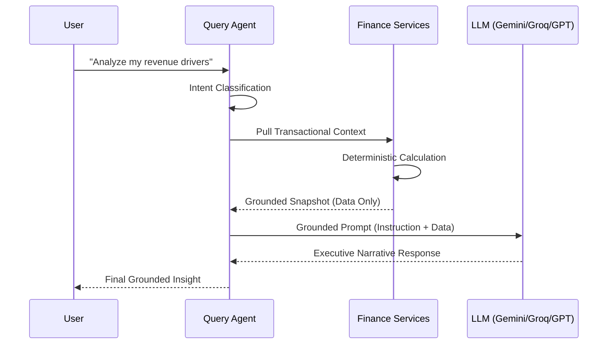
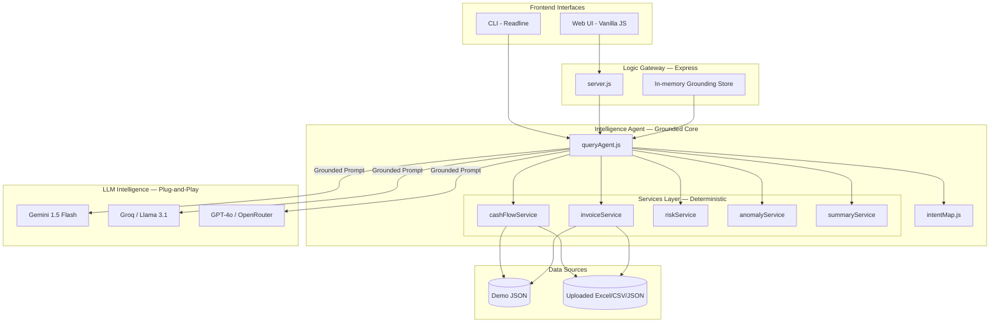

# CashGuardian — Presentation

---

## Problem Statement

> *[Visual: Blank terminal or cluttered spreadsheet on screen]*

"Imagine you're running a business. It's the end of the month and you need answers fast.
How much cash do I actually have? Which clients owe me money? Are my expenses spiking?

But instead of getting answers, you're stuck inside spreadsheets, complex BI dashboards, and finance tools that take hours to learn and seconds to confuse you.

This is the reality for most founders and operators today — and it's not a data problem. It's a **communication** problem.

**Introducing CashGuardian** — Talk to your business finances in plain English."

---

## Segment 2 — Problem Deep Dive
**Timing: [0:45 – 1:15]**

> *[Visual: Problem Statement Pillars]*

| Pillar | Challenge Faced by SMEs | CashGuardian Solution |
|---|---|---|
| **Clarity** | BI tools speak jargon. Founders need plain answers. | Plain-English AI narratives with `summaryService`. |
| **Trust** | AI-generated numbers can hallucinate. | Grounded reasoning using locked transactional data. |
| **Speed** | Waiting minutes for dashboards to load kills momentum. | Deterministic services layer returning in <2ms. |

"The core challenges teams face are Clarity, Trust, and Speed. CashGuardian was built specifically to solve these three friction points by bridge deterministic financial logic with generative AI narratives."

---

## Segment 3 — Solution & Key Features
**Timing: [1:15 – 2:15]**

| # | Use Case | CashGuardian Feature |
|---|---|---|
| 1 | Understand what changed | **Anomaly Detection** — flags spikes vs 8-week rolling averages. |
| 2 | Compare time periods | **Period Comparison Engine** — WoW and MoM with % deltas. |
| 3 | Breakdown / decomposition | **Expense Categorization** — identifies top drivers and client risk. |
| 4 | Summarise performance | **Agentic Summaries** — Weekly/Monthly performance dossiers. |

"CashGuardian is a full-stack Talk-to-Data platform. It empowers users with:
- **Natural Language Querying**: No more SQL or manual filtering.
- **Grounded AI Reasoning**: The most critical differentiator. The AI only narrates what our services have already verified.
- **Summary PDF Export**: One-click professional reporting for stakeholders.
- **Built-in Speech Recognition**: For hands-free, high-speed querying."

---

## Segment 4 — Architecture & Tech Stack
**Timing: [2:15 – 3:00]**

> *[Visual: The Query Lifecycle Sequence]*

"Our 'Grounding-First' pipeline ensures reliability. Every query starts with Intent Classification, follows with Deterministic Calculation, and ends with Generative Narration."

---

> *[Visual: Full System Architecture Overview]*

---

> *[Visual: The Tech Stack]*

| Layer | Technologies |
|---|---|
| **Runtime & Backend** | Node.js 18+, Express |
| **Agent Discovery** | **LangChain / LangGraph** — Stateful Reasoning & Orchestration |
| **Interfaces** | Vanilla JS / CSS / HTML, CLI (Readline) |
| **Data Reasoning** | Gemini 1.5 Flash (Primary), Groq, OpenRouter |
| **Visuals & Reports** | Chart.js, **jsPDF** (Summary Reports) |
| **Reliability** | Jest (63 Tests), Automated Benchmark Suite |
| **Deployment** | Vercel (CI/CD) |

---

## Segment 5 — Live Demo
**Timing: [3:00 – 4:20]**

> *[Visual: Live Web Dashboard]*

"Let me show you this in action.

**Step 1 — Web Dashboard**
Everything from balance tracking to 13-week trends is available at a glance.

**Step 2 — Natural Language Querying**
We can ask: 'What is my current cash balance?' or 'Show me overdue invoices'. The system returns grounded responses verified against our ledger.

**Step 3 — Anomaly Detection**
'Are there any unusual patterns in my spending?' 
CashGuardian identifies a 72% logistics spike, providing the exact window and severity level.

**Step 4 — Executive Summary PDF**
Finally, we can generate a professional summary. One click creates a comprehensive PDF report ready for stakeholders."

---

## Segment 6 — Benchmark & Trust
**Timing: [4:20 – 4:45]**

> *[Visual: Benchmark Results]*

"We verified our platform against 13 real-world ground-truth finance cases.

- **Quality Score**: 43/53 (Grade: Good)
- **Average Latency**: 70ms
- **Deterministic Service Latency**: < 2ms

Every response includes a transparency block, showing exactly which data was used to ground the AI's explanation."

---

## Segment 7 — Closing
**Timing: [4:45 – 5:00]**

> *[Visual: Live URL: cash-guardian-three.vercel.app]*

"CashGuardian is live right now. No sign-up. Just talk to your data and trust your answers.

**Thank you.**"

---

## Speaker Notes

| Segment | Key Point to Emphasize |
|---|---|
| Hook | Lead with the pain of manual data analysis. |
| Problem | Clearly contrast 'Clarity, Trust, Speed' against legacy tools. |
| Features | Emphasize that AI never calculates—it only narrations. |
| Architecture | Show how the Services Layer protects the LLM from hallucinating. |
| Demo | Demonstrate the transition from a query to a professional PDF. |
| Benchmark | Use the numbers to prove production-readiness. |
| Close | Reiterate the live URL for immediate engagement. |

---

*Total estimated time: ~4 min 55 sec.*
